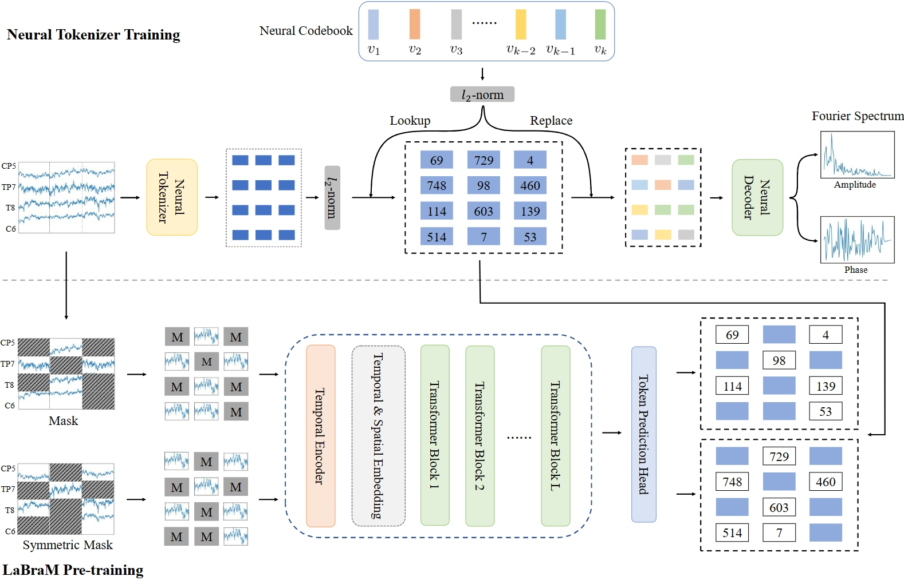

# LaBraM

Official implementation of our ICLR 2024 paper:
[**Large Brain Model for Learning Generic Representations with Tremendous EEG Data in BCI**](https://openreview.net/forum?id=QzTpTRVtrP)



## Abstract

The current electroencephalogram (EEG) based deep learning models are typically designed for specific datasets and applications in brain-computer interaction (BCI), limiting the scale of the models and thus diminishing their perceptual capabilities and generalizability. Recently, Large Language Models (LLMs) have achieved unprecedented success in text processing, prompting us to explore the capabilities of Large EEG Models (LEMs). We hope that LEMs can break through the limitations of different task types of EEG datasets, and obtain universal perceptual capabilities of EEG signals through unsupervised pre-training. Then the models can be fine-tuned for different downstream tasks. However, compared to text data, the volume of EEG datasets is generally small and the format varies widely. For example, there can be mismatched numbers of electrodes, unequal length data samples, varied task designs, and low signal-to-noise ratio. To overcome these challenges, we propose a unified foundation model for EEG called Large Brain Model (LaBraM). LaBraM enables cross-dataset learning by segmenting the EEG signals into EEG channel patches. Vector-quantized neural spectrum prediction is used to train a semantically rich neural tokenizer that encodes continuous raw EEG channel patches into compact neural codes. We then pre-train neural Transformers by predicting the original neural codes for the masked EEG channel patches. The LaBraMs were pre-trained on about 2,500 hours of various types of EEG signals from around 20 datasets and validated on multiple different types of downstream tasks. Experiments on abnormal detection, event type classification, emotion recognition, and gait prediction show that our LaBraM outperforms all compared SOTA methods in their respective fields.

---

## Environment Setup

Create the environment and install dependencies:

```bash
conda create -n labram python=3.11
conda activate labram
conda install pytorch==2.0.1 torchvision==0.15.2 torchaudio==2.0.2 pytorch-cuda=11.8 -c pytorch -c nvidia
conda install tensorboardX
pip install -r requirements.txt
```

---

## [IMPORTANT] Fine-tune on Your Own Dataset

You can adapt LaBraM to your own datasets by following the fine-tuning scripts provided for TUAB and TUEV. Simply replace the dataset-specific parts of the code with your own data. When doing so, make sure to:

1. Load a pre-trained LaBraM checkpoint.
2. Provide the input channel order list to specify the channel configuration.

**The above two points are significant to obtain normal performance of LaBraM.**

---

## Running Experiments

### 1. Prepare Pre-training Data

Convert raw EEG files (e.g., `.cnt`, `.edf`, `.bdf`) into HDF5 format using:

```
dataset_maker/make_h5dataset_for_pretrain.py
```

You may also implement your own preprocessing pipeline, but please ensure it matches the setup in our paper:

* Remove irrelevant channels
* Bandpass filter: **0.1–75 Hz**
* Notch filter: **50 Hz**
* Resample to **200 Hz**
* Set unit to **µV**

---

### 2. Train the Neural Tokenizer

The tokenizer is trained via **vector-quantized neural spectrum prediction (VQ-NSP)**. We recommend training on **8 × NVIDIA RTX 3090 (or better)** GPUs.

```bash
OMP_NUM_THREADS=1 torchrun --nnodes=1 --nproc_per_node=8 run_vqnsp_training.py \
    --output_dir ./checkpoints/vqnsp/ \
    --log_dir ./log/vqnsp/ \
    --model vqnsp_encoder_base_decoder_3x200x12 \
    --codebook_n_emd 8192 \
    --codebook_emd_dim 64 \
    --quantize_kmeans_init \
    --batch_size 128 \
    --opt adamw \
    --opt_betas 0.9 0.99 \
    --weight_decay 1e-4 \
    --warmup_epochs 10 \
    --epochs 100 \
    --save_ckpt_freq 20
```

---

### 3. Pre-train LaBraM

Pre-train LaBraM by reconstructing masked neural codes from EEG channel patches:

```bash
OMP_NUM_THREADS=1 torchrun --nnodes=1 --nproc_per_node=8 run_labram_pretraining.py \
    --output_dir ./checkpoints/labram_base \
    --log_dir ./log/labram_base \
    --model labram_base_patch200_1600_8k_vocab \
    --tokenizer_model vqnsp_encoder_base_decoder_3x200x12 \
    --tokenizer_weight ./checkpoints/vqnsp.pth \
    --batch_size 64 \
    --lr 5e-4 \
    --warmup_epochs 5 \
    --clip_grad 3.0 \
    --drop_path 0. \
    --layer_scale_init_value 0.1 \
    --opt_betas 0.9 0.98 \
    --opt_eps 1e-8 \
    --epochs 50 \
    --save_ckpt_freq 5 \
    --codebook_dim 64 \
    --gradient_accumulation_steps 1
```

---

### 4. Fine-tune on Downstream Tasks

Preprocess datasets (e.g., TUAB, TUEV) using:

```
dataset_maker/make_TUAB.py
dataset_maker/make_TUEV.py
```

This includes preprocessing and splitting into train/val/test sets. Hyperparameters such as **learning rate** and **warmup epochs** strongly affect results—tune them for best performance. Below is the TUAB example:

```bash
OMP_NUM_THREADS=1 torchrun --nnodes=1 --nproc_per_node=8 run_class_finetuning.py \
    --output_dir ./checkpoints/finetune_tuab_base/ \
    --log_dir ./log/finetune_tuab_base \
    --model labram_base_patch200_200 \
    --finetune ./checkpoints/labram-base.pth \
    --weight_decay 0.05 \
    --batch_size 64 \
    --lr 5e-4 \
    --update_freq 1 \
    --warmup_epochs 5 \
    --epochs 50 \
    --layer_decay 0.65 \
    --drop_path 0.1 \
    --save_ckpt_freq 5 \
    --disable_rel_pos_bias \
    --abs_pos_emb \
    --dataset TUAB \
    --disable_qkv_bias \
    --seed 0
```

---

## Citation

If you find our paper/code useful, please consider citing our work:

```bibtex
@inproceedings{
jiang2024large,
title={Large Brain Model for Learning Generic Representations with Tremendous {EEG} Data in {BCI}},
author={Wei-Bang Jiang and Li-Ming Zhao and Bao-Liang Lu},
booktitle={The Twelfth International Conference on Learning Representations},
year={2024},
url={https://openreview.net/forum?id=QzTpTRVtrP}
}
```
